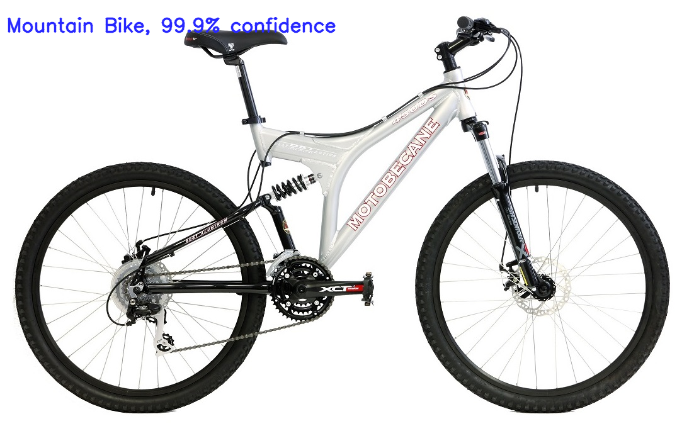
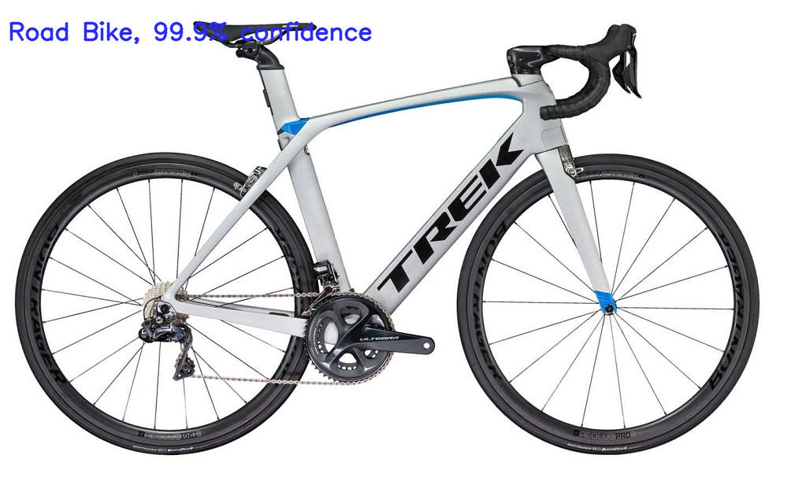

Bike-Classifier
===============
Mountain Bike and Road Bike Classifier using Tensorflow

Dependencies
----------------

##### TensorFlow
* pip install tensorflow

##### OpenCV
* pip install opencv-python

##### scipy
* pip install scipy

##### scikit-learn
* pip install scikit-learn

Download Images
---------------
Run download.py to download and extract bikes_ds.zip
```sh
$ python download.py
```

Train
-----
Run train.py to train the model. Model is saved to ckpt.
```sh
$ python train.py
```

Test
----
Run test.py to see how well the model performs on test images.
```sh
$ python test.py
```

Sample Predictions
------------------
Mountain Bike              |  Road Bike
:-------------------------:|:-------------------------:
 | 
